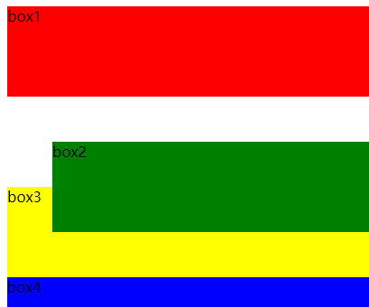
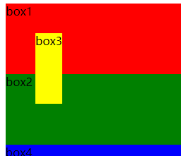

# 基础
## 样式种类
1. 内联样式（style）
2. 内部样式（选择器）
3. 外部样式（link标签引入）

## 选择器
1. 标签选择器(标签名)
2. id选择器(id)
3. class选择器(class)
4. 后代选择器(空格) 
5. 子代选择器(>)
6. 相邻兄弟选择器(+， ~)
::: tip 区分
a b:  选取a后代的所有b

a+b:  选取a相邻的后**第一个**b

a~b:  选取a同级后面的所有b
::: 
7. 伪类选择器(a: hover  :link（链接未访问）  :visited（已访问）  :active（链接点击） :not(除了))
8. 伪元素选择器(::after  ::before，表现为行内元素, content属性必备)
9.  属性选择器([ 属性名 ] [ 属性名=属性值] )
```css
a[href] {color:red;}   // a标签内含href属性则会生效
```
## 常见属性
### 背景background
- [CSS中background的用法](https://www.cnblogs.com/sheshou/p/5202947.html)

**background-color || background-image || background-repeat || background-attachment || background-size || background-clip || background-position**

::: tip
1. 若div不设置宽高则不会显示
2. background-size: 100% 100% 会铺满全屏,可通过cover或contain保持原比例
3. 图片默认是repeat
4. 针对精灵图(雪碧图)，通过background-position（x，y）来定位相应的图片。如（10px, 10px）像右像向下移动10px；
:::

### 位移transfrom
**属性值**
- translate(x,y)、translateX(x)、translateY(y)、translateZ(z)、translate3d(x,y,z) 定义位置的移动距离
- scale(x,y)、scaleX(x)、scaleY(y)、scaleZ(z)、scale3d(x,yz) 定义元素的缩放比例
- rotate(angle)、rotateX(angle)、rotateY(angle)、rotateZ(angle)、rotate3d(x,y,z,angle) 定义元素的旋转度
- skew(x-angle,y-angle)、skewX(angle)、skewY(angle) 定义元素的倾斜度
::: tip
可以为transform添加动画： transition：transform  1s;
:::

### 图片img
::: tip
不设置宽高原图显示，设置宽高会自适应显示
:::

### 动画
- [CSS动画与transform属性](https://juejin.cn/post/7051148335708651528)

**3种实现动画的方式: transtion, animation, transform**

**transition**和**animation**会触发页面的【重绘】【重排】，因此他们的渲染成本是比较高的。

而**transform**是GPU进程渲染的，不会触发重绘和重排，效率更高。所以即使浏览器渲染进程阻塞了，我们会发现transform的动画仍然会正常运行。
::: tip
animation动画有3个事件：
  开始事件: webkitAnimationStart

  结束事件: webkitAnimationEnd
  
  重复运动事件: webkitAnimationIteration
:::
### z-index
决定了`同一父元素下`的同级子元素的堆叠顺序
::: tip
只要不是默认值static，其他的absolute、relative、fixed都可以使z-index生效。

失效情况: 
1. 父元素的z-index更小，导致元素被遮挡

2. 该元素static定位, 设置absolute定位即可
:::
### vertical-align
- [关于vertical-align你应该知道的一切](https://juejin.cn/post/6844904084885995528)


## 盒模型
组成： 从外到内包括4部分，margin + border + padding + content

1. **标准盒模型（W3C）：** width = 内容的宽度
2. **怪异盒模型(IE盒模型)：**  width= 内容的宽度 + padding值 + border值
   
```css
box-sizing: content-box;   // 默认的W3C盒子模型，也叫标准盒子模型
box-sizing: border-box;   // IE盒模型，也叫怪异盒模型
box-sizing: inherit;   // 继承父元素的box-sizing属性的值
```

## 定位方式
**1. positioin：relative**

定位后 `空间不释放`，相对于`初始位置`定位
<center>

</center>

**2. position：absolute**

定位后`空间释放`，若`除static定位外`的第一个有定位属性的父元素进行定位，若无则相对于body定位 ，所以一般子绝父相
<center>

</center>

**3. position：fixed**

定位后`空间释放`，相对于`可视页面`定位，所以即使有滚动条也不影响

**失效情况：** 只要父级元素中存在transform属性都会使该fixed定位失效，即相对该祖先元素定位

**4. [postion： sticky](https://juejin.cn/post/6844904087486464007)**

粘性定位，比如某个某个元素滑到底时需做吸顶样式。

需设置上下左右4个值的一个，并且父元素不能设置overflow: hidden, 否则失效

缺点：IE不支持，低版本的浏览器也不支持; z-index无效。

## 	浮动float
1. 浮动的元素，会`脱离文档流，空间释放`
2. 造成的问题：子元素浮动，若父元素高度不够或未设置高度，会造成父盒子高度坍塌。
3. 消除浮动有3种方法，见面试相关
4. 浮动布局一般在末尾都要做清除浮动处理，可设置伪元素解决

## flex布局
弹性布局，外部盒子称之为`容器`，内部盒子称之为`项目`

**1. 容器属性（5个）**

`flex-direction(主轴排列方向)`: row(默认) | column  | row-reverse | column-reverse

`flex-wrap(是否换行)`: no-wrap(默认) | wrap | wrap-reverse 

`Flex-flow(上述2者缩写)`: row | no-wrap;

`Justifiy-content(主轴对齐方式)`: flex-start | flex-end | center | space-between | space-around

`Align-items(纵轴)`: flex-start | flex-end | center | stretch(侧抽拉伸) | baseline（类似水平线对齐）

**2. 项目属性**

`order(定义项目的排序顺序)`: 默认为0，数值越小，排列越前，可以为负值

`Flex-grow(定义项目的放大比列)`: 默认为0，即使有剩余空间，也不做放大 （项目等值情况则等分剩余空间）

`flex-shrink(定义项目的缩小比例)`: 默认为1，如果空间不足，该项目将缩小（若有一个值为0且空间不足，该项目不会缩小）（若有所有值为0且空间不足，则会造成溢出但不换行，因为默认不换行） 

`Flex-basis(定义项目占的主轴空间)`: 默认为auto，可设置固定宽度（仅空间充足情况，空间不足的话仍然会缩小）

`align-self(单个项目侧轴对齐方式)`: 默认是auto，表示继承父类的align-items的属性值。其他值等同于align-items

::: tip flex缩写(grow,shrink,basis)
Flex: 默认值 0  1  auto，对应上面3个默认值

它有2个快捷值 auto（1  1  auto）;  表示空间剩余，该item项会填充剩余空间，grow为1

none （0  0  auto）; 表示空间不足时，该item依旧保持原有宽度 ，shrink为0
:::
::: warning
flex:1;  表示占满剩余空间大小，若剩余空间不足则该item项不显示!
:::


## 文章
- [less中变量的使用](https://segmentfault.com/a/1190000037649660)
  
- [iphone刘海屏适配](https://blog.csdn.net/qq_42354773/article/details/81018615)

